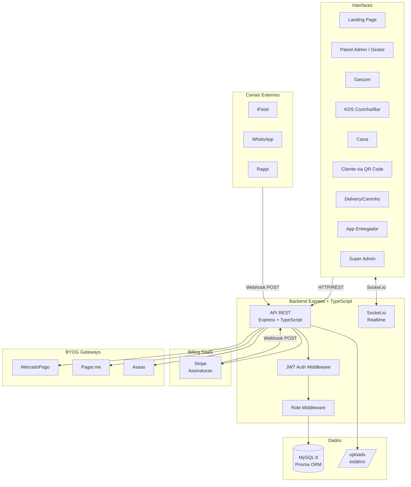

# Documentação de Arquitetura — Dine

> Documento de referência da arquitetura completa da plataforma | 2026-06-30

---

## Visão Geral

O **Dine** é uma plataforma SaaS B2B de gestão gastronômica. Permite que bares e restaurantes operem com comandas digitais via QR Code, delivery, KDS (Kitchen Display System), CRM, automações de marketing e canais omnichannel — tudo sob um modelo de assinatura recorrente.

---

## Diagrama de Arquitetura do Sistema



---

## Stack Tecnológica

### Backend
| Tecnologia | Versão | Propósito |
|-----------|--------|-----------|
| Node.js | 18+ | Runtime |
| Express | 4.x | HTTP Server |
| TypeScript | 5.x | Tipagem |
| Prisma | 5.x | ORM + Migrations |
| MySQL | 8.x | Banco de Dados |
| Socket.io | 4.x | Realtime |
| JWT | — | Autenticação |
| Zod | — | Validação |
| Stripe SDK | — | Billing SaaS |

### Frontend
| Tecnologia | Versão | Propósito |
|-----------|--------|-----------|
| Next.js | 14+ | Framework React |
| TypeScript | 5.x | Tipagem |
| Tailwind CSS | 3.x | Estilização |
| shadcn/ui | — | Componentes |
| axios | — | HTTP Client |
| framer-motion | — | Animações |
| Socket.io Client | — | Realtime |

---

## Modelo de Multi-Tenancy

Cada restaurante é um **Estabelecimento** (tenant). O isolamento é feito por `estabelecimentoId` em todas as entidades operacionais.

```
JWT payload: { id, tipo, estabelecimentoId }
                                     ↑
                    Usado em TODA query para filtrar dados
```

---

## Camadas da Aplicação

```
HTTP Request
    ↓
Middlewares (CORS → JSON → auth → role → validate)
    ↓
Controller (req/res → chama service)
    ↓
Service (lógica de negócio → chama Prisma)
    ↓
Prisma ORM → MySQL
    ↓
Controller emite evento Socket.io (se necessário)
    ↓
HTTP Response
```

---

## Modelo de Dados (Resumo)

O sistema tem ~30 entidades organizadas em grupos:

1. **Core Operacional:** Estabelecimento, Usuario, Mesa, GrupoMesa, Categoria, Produto, Comanda, Pedido, PedidoItem
2. **SaaS/Financeiro:** Plano, Assinatura, CredencialGateway, Transacao, PagamentoParcial
3. **CRM/Delivery:** Cliente, EnderecoCliente, Corrida, LocalizacaoEntregador
4. **Avançado:** Avaliacao, Cupom, CanalExterno, PedidoExterno, RegraAutomacao, FilaEspera, Reserva

Ver diagrama ER completo em `docs/database/er-model.md`.

---

## Módulos do Sistema

| Módulo | Papéis | Documentação |
|--------|--------|-------------|
| Comanda | Cliente, Garçom, Admin | [comanda.md](modules/comanda.md) |
| Pedido / KDS | Cozinha, Bar, Expedição | [pedido.md](modules/pedido.md), [kds.md](modules/kds.md) |
| Delivery | Cliente, Entregador, Admin | [delivery.md](modules/delivery.md) |
| Garçom | Garçom, Admin | [garcom.md](modules/garcom.md) |
| Caixa | Caixa, Admin | [caixa.md](modules/caixa.md) |
| Cardápio | Público, Admin | [cardapio.md](modules/cardapio.md) |
| CRM | Admin | [crm.md](modules/crm.md) |
| Cupons | Cliente, Admin | [cupons.md](modules/cupons.md) |
| Automações | Admin | [automacoes.md](modules/automacoes.md) |
| Omnichannel | Admin, Canais Externos | [omnichannel.md](modules/omnichannel.md) |
| Dashboard | Admin | [dashboard.md](modules/dashboard.md) |
| Expedição | Admin | [expedicao.md](modules/expedicao.md) |
| Recepção | Admin | [recepcao.md](modules/recepcao.md) |
| Assinaturas | Admin, Stripe | [assinaturas.md](modules/assinaturas.md) |
| Super Admin | Superadmin | [superadmin.md](modules/superadmin.md) |

---

## Decisões Arquiteturais

Ver ADRs em `docs/adr/`:
- [ADR-001](adr/ADR-001-database-mysql-prisma.md) — MySQL + Prisma
- [ADR-002](adr/ADR-002-auth-jwt.md) — JWT Auth
- [ADR-003](adr/ADR-003-frontend-nextjs.md) — Next.js App Router
- [ADR-004](adr/ADR-004-realtime-socketio.md) — Socket.io
- [ADR-005](adr/ADR-005-saas-billing-model.md) — Billing Stripe
- [ADR-006](adr/ADR-006-byog-payment-gateway.md) — BYOG

---

## Melhorias Identificadas

Ver relatório completo em `docs/audit/improvements.md`.

Prioridades críticas:
- Criptografar credenciais BYOG em repouso
- Remover endpoint seed de produção
- Implementar rate limiting no login
- Implementar entitlements por plano
