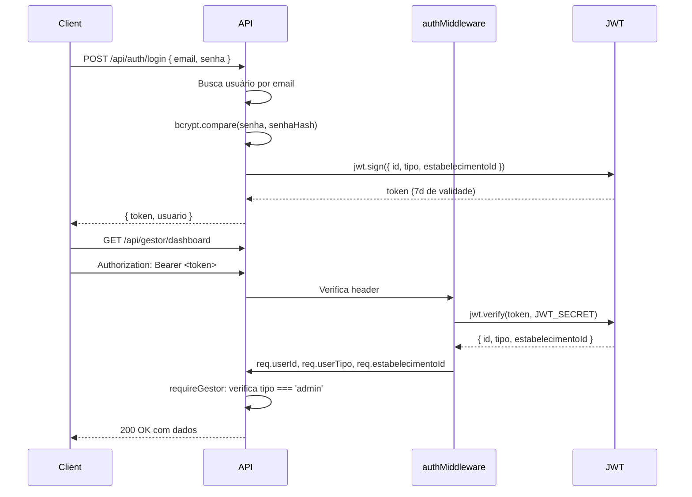
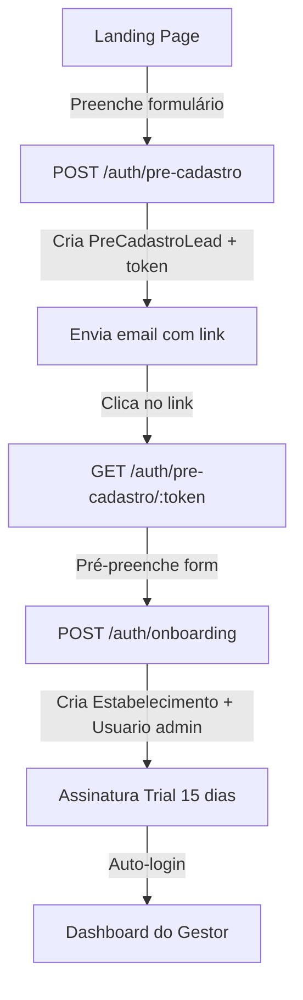

# Autenticação e Autorização — Dine

> Fonte: `backend/src/middlewares/auth.middleware.ts`, `auth.routes.ts`, `auth.controller.ts` | 2026-06-30

---

## Objetivo

Documentar o sistema de autenticação JWT, os papéis de usuário e o fluxo de autorização por rota.

---

## Fluxo de Autenticação



---

## Rotas de Autenticação

| Método | Rota | Auth | Descrição |
|--------|------|------|-----------|
| POST | /api/auth/login | Não | Login por email + senha |
| POST | /api/auth/register | Não | Criar usuário admin (primeiro acesso) |
| POST | /api/auth/onboarding | Não | Cadastro de novo estabelecimento (self-service) |
| POST | /api/auth/forgot-password | Não | Solicitar recuperação de senha |
| POST | /api/auth/reset-password | Não | Redefinir senha com token |
| GET | /api/auth/me | Sim | Dados do usuário autenticado |
| PUT | /api/auth/me/estabelecimento | Sim | Atualizar dados do estabelecimento |
| POST | /api/auth/pre-cadastro | Não | Lead da landing page |
| GET | /api/auth/pre-cadastro/:token | Não | Buscar lead pelo token |

---

## Papéis de Usuário (TipoUsuario)

| Tipo | Descrição | Acesso |
|------|-----------|--------|
| `superadmin` | Administrador da plataforma | Tudo: `/api/superadmin/*` |
| `admin` | Gestor do estabelecimento | Painel admin: `/api/gestor/*`, `/api/caixa/*`, etc. |
| `garcom` | Garçom | `/api/garcom/*` |
| `cozinha` | Equipe de cozinha | `/api/cozinha/*` (destino=COZINHA) |
| `bar` | Equipe do bar | `/api/cozinha/*` (destino=BAR) |
| `entregador` | Entregador | `/api/delivery/*` (rotas de entregador) |
| `cliente` | Cliente final | Não usa JWT — acesso por código de comanda |

---

## Middlewares de Autorização

```typescript
// auth.middleware.ts

// 1. Verifica JWT + injeta dados no request
authMiddleware → req.userId, req.userTipo, req.estabelecimentoId

// 2. Verificações de papel
adminMiddleware    → tipo === 'admin'
garcomMiddleware   → tipo === 'garcom' || 'admin'
preparoMiddleware  → tipo === 'cozinha' || 'bar' || 'admin'

// role.middleware.ts

requireGestor     → tipo === 'admin'
requireGarcom     → tipo === 'garcom' || 'admin'
requireCozinha    → tipo === 'cozinha' || 'bar' || 'admin'
requireEntregador → tipo === 'entregador' || 'admin'
requireSuperAdmin → tipo === 'superadmin'
```

---

## Payload do JWT

```typescript
interface JwtPayload {
    id: string;               // UUID do usuário
    tipo: TipoUsuario;        // papel do usuário
    estabelecimentoId?: string; // undefined para superadmin
}
```

- Validade: **7 dias** (implícito, verificar `jwt.sign` options em auth.service)
- Algoritmo: HS256 (padrão jsonwebtoken)
- Secret: variável `JWT_SECRET`

---

## Onboarding (Self-Registration)



---

## Acesso Operacional (Garçom/Cozinha/Bar)

Os usuários operacionais (garçom, cozinha, bar) podem usar:
1. **Login por email/senha** — mesma rota `/api/auth/login`
2. **Código de acesso** — campo `codigoAcesso` no model Usuario (acesso via `/acesso` no frontend)

---

## Segurança

- Senhas hasheadas com `bcryptjs` (salt rounds: 10)
- JWT assinado com `JWT_SECRET` (deve ter entropia alta)
- Erros de JWT geram `UnauthorizedError` (401), não expõem detalhes
- Webhook do Stripe usa `express.raw()` + `STRIPE_WEBHOOK_SECRET` para validação de assinatura

---

## Extensão do Express Request

```typescript
// types/express.d.ts
interface AuthRequest extends Request {
    userId?: string;
    userTipo?: TipoUsuario;
    estabelecimentoId?: string;
    user?: {
        id: string;
        tipo: TipoUsuario;
        estabelecimentoId?: string;
    };
}
```

---

## Limitações e Melhorias Recomendadas

1. **Refresh token** não implementado — usuários precisam re-logar após 7 dias
2. **Revogação de token** não implementada — tokens antigos são válidos até expirar
3. **Rate limiting** no login não verificado
4. **2FA** não implementado
5. **Auditoria de login** (log de último acesso existe: `usuario.ultimoAcesso`) mas não há log de tentativas falhas
