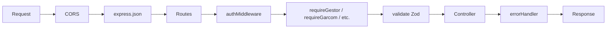

# Middlewares — Backend Dine

> Fonte: `backend/src/middlewares/` | Atualizado em: 2026-06-30

---

## Visão Geral



---

## 1. authMiddleware

**Arquivo:** `auth.middleware.ts`

Verifica o token JWT no header `Authorization: Bearer <token>`.

**Comportamento:**
1. Extrai token do header Authorization
2. Verifica com `jwt.verify(token, JWT_SECRET)`
3. Injeta no request: `req.userId`, `req.userTipo`, `req.estabelecimentoId`, `req.user`
4. Erros retornam `401 Unauthorized`

```typescript
// Uso em rota:
router.get('/rota', authMiddleware, controller);
```

---

## 2. adminMiddleware

**Arquivo:** `auth.middleware.ts`

Restringe acesso a usuários com `tipo === 'admin'`.

```typescript
router.post('/rota', authMiddleware, adminMiddleware, controller);
```

---

## 3. garcomMiddleware

**Arquivo:** `auth.middleware.ts`

Permite acesso a `tipo === 'garcom'` ou `tipo === 'admin'`.

---

## 4. preparoMiddleware

**Arquivo:** `auth.middleware.ts`

Permite acesso a `tipo === 'cozinha'`, `tipo === 'bar'` ou `tipo === 'admin'`.

---

## 5. requireGestor / requireGarcom / requireCozinha / requireEntregador / requireSuperAdmin

**Arquivo:** `role.middleware.ts`

Middlewares nomeados com verificações de papel:

| Middleware | Tipos permitidos |
|-----------|-----------------|
| requireGestor | admin |
| requireGarcom | garcom, admin |
| requireCozinha | cozinha, bar, admin |
| requireEntregador | entregador, admin |
| requireSuperAdmin | superadmin |

---

## 6. errorHandler

**Arquivo:** `error.middleware.ts`

Middleware global de erros — deve ser registrado **após** todas as rotas.

**Resposta padrão de erro:**
```json
{
  "error": "Mensagem amigável do erro",
  "code": "CODIGO_PRISMA",
  "details": {}
}
```

**Tipos tratados:**
- `AppError` (custom) → usa o statusCode da instância
- Erros do Prisma (`P2002` unique, `P2025` not found, etc.)
- Erros de validação Zod → 400
- Erros genéricos → 500

---

## 7. validate (Zod)

**Arquivo:** `validate.middleware.ts`

Valida `req.body`, `req.params` e `req.query` contra um schema Zod.

```typescript
// Schema exemplo (schemas/comanda.schema.ts):
export const criarComandaSchema = z.object({
    body: z.object({
        estabelecimentoId: z.string().uuid(),
        nomeCliente: z.string().min(1),
        telefoneCliente: z.string()
    })
});

// Uso:
router.post('/comandas', validate(criarComandaSchema), controller);
```

**Erro de validação:**
```json
{
  "error": "Dados inválidos",
  "details": [
    { "path": ["body", "nomeCliente"], "message": "Required" }
  ]
}
```

---

## 8. upload (Multer)

**Arquivo:** `upload.middleware.ts`

Middleware para upload de arquivos via `multipart/form-data`.

- Storage: disco local (pasta `uploads/`)
- Tipos permitidos: imagens (jpeg, png, webp)
- Limite de tamanho: configurável

---

## asyncHandler

**Arquivo:** `error.middleware.ts`

Wrapper para controllers async que captura erros e passa para o `errorHandler`:

```typescript
export const asyncHandler = (fn: RequestHandler) => (req, res, next) => {
    Promise.resolve(fn(req, res, next)).catch(next);
};
```

Uso padrão em todos os controllers.
