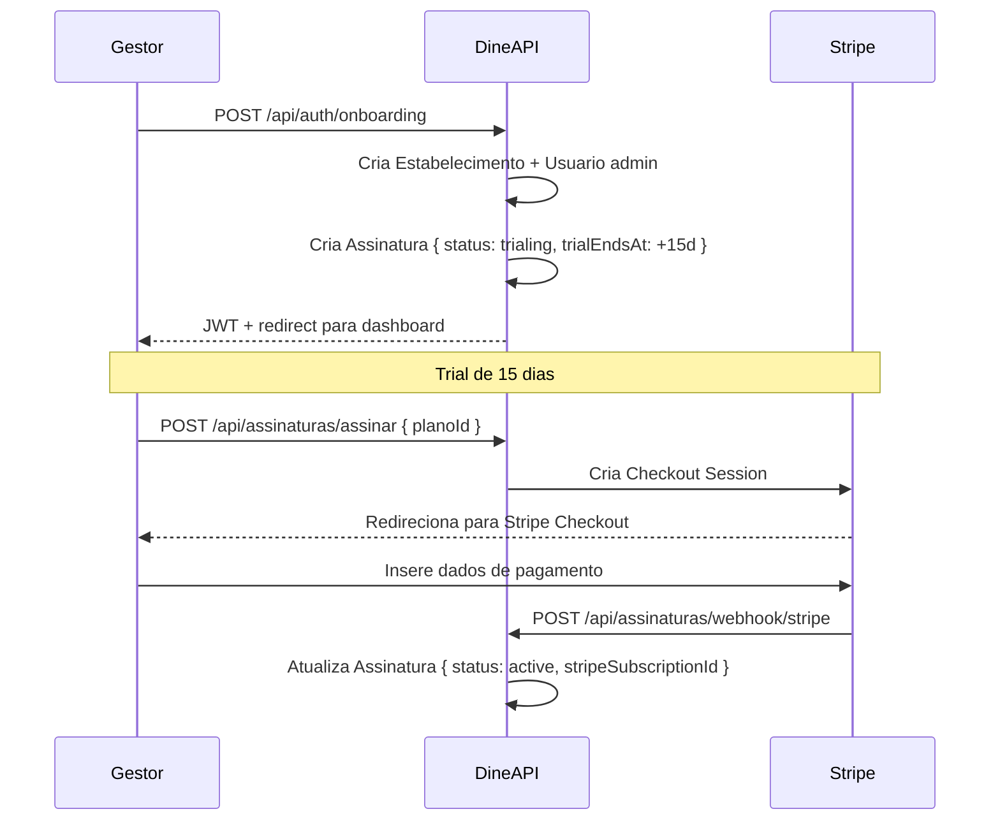
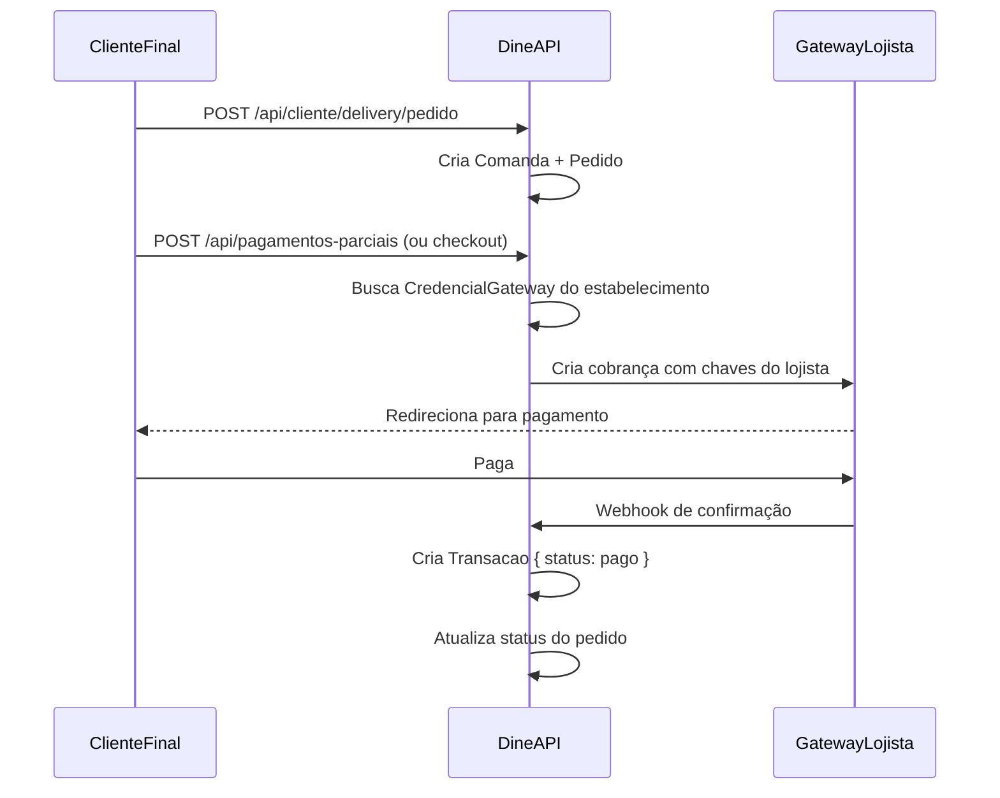

# Billing e Assinaturas SaaS — Dine

> Fonte: schema.prisma + PLANO_TATICO_90_DIAS_BRANDING_BILLING.md | 2026-06-30

---

## Modelo de Cobrança

O Dine opera dois modelos financeiros paralelos e independentes:

| Modelo | Quem paga | Para quem | Tecnologia |
|--------|-----------|-----------|-----------|
| **SaaS Billing** | Restaurante → Dine | Uso da plataforma | Stripe |
| **BYOG Transacional** | Cliente final → Restaurante | Pedidos e deliveries | MercadoPago / Pagar.me / Asaas |

---

## SaaS Billing (Stripe)

### Entidades Relevantes

```
Estabelecimento 1:1 Assinatura N:1 Plano
```

### Fluxo de Assinatura



### Webhook Stripe

```
POST /api/assinaturas/webhook/stripe
Content-Type: application/json (raw body para validação de assinatura)
Header: Stripe-Signature: <assinatura>

Eventos tratados:
- checkout.session.completed → active
- invoice.payment_succeeded → renova currentPeriodEnd
- invoice.payment_failed → past_due
- customer.subscription.deleted → canceled
- customer.subscription.paused → paused
```

---

## BYOG — Bring Your Own Gateway

O restaurante configura suas próprias credenciais de pagamento. Os fundos vão direto para a conta do restaurante. O Dine não processa nem custodia os valores.

### Provedores Suportados

| Provedor | Status |
|---------|--------|
| MercadoPago | Suportado |
| Pagar.me | Suportado |
| Asaas | Suportado |
| Stripe (do lojista) | Suportado |

### Entidade CredencialGateway

```prisma
model CredencialGateway {
  estabelecimentoId String
  provedor          ProvedorGateway  // mercadopago | pagarme | asaas | stripe
  publicKey         String?
  secretKey         String?          // NUNCA expor ao frontend
  webhookSecret     String?
  ativo             Boolean
}
```

**Segurança:** As chaves de API do lojista devem ser criptografadas em repouso. Nunca devem ser retornadas ao frontend em texto claro.

### Fluxo de Pagamento BYOG



---

## Divisão de Conta (PagamentoParcial)

Permite que comensais de uma mesma comanda paguem separadamente.

```
Comanda 1:N PagamentoParcial
```

Cada `PagamentoParcial` registra:
- `telefoneCliente` — identifica o comensal
- `valor` — valor que ele se responsabilizou
- `status` — pendente | pago | erro

---

## Transações

O model `Transacao` registra todas as movimentações financeiras:

| Campo | Descrição |
|-------|-----------|
| `metodo` | pix, cartao_credito, cartao_debito, dinheiro |
| `provedor` | mercadopago, pagarme, manual, stripe |
| `providerId` | ID da transação no gateway externo |
| `status` | pendente → processando → pago | falhou | reembolsado |

---

## KPIs de Billing (Monitoramento)

| KPI | Descrição |
|-----|-----------|
| MRR | Monthly Recurring Revenue |
| ARPA | Average Revenue Per Account |
| Churn mensal | % de cancelamentos |
| Conversão trial → pago | % de trials que convertem |
| Taxa de falha de cobrança | % de faturas com erro |
| Inadimplência e recuperação | Via dunning |
| Tempo médio de ativação | Da criação do trial ao primeiro pedido real |

---

## Runbook de Suporte

| Situação | Ação |
|---------|------|
| Gestor relata cobrança errada | Verificar `Assinatura.stripeSubscriptionId` no Stripe Dashboard |
| Trial expirado mas gestor não converteu | Status `canceled` — reativar via superadmin ou link de upgrade |
| Pagamento recusado | Status `past_due` — dunning ativo: retentativas + notificação |
| Bloqueio indevido | Verificar webhook Stripe processado + `Assinatura.status` |
| Estorno solicitado | Processar via Stripe Dashboard + atualizar `Transacao.status = reembolsado` |
