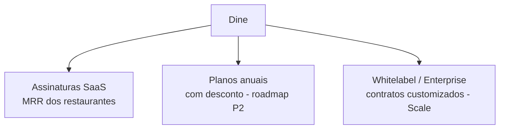

# Modelo de Monetização — Dine

> 2026-06-30

---

## Fonte de Receita Principal

**SaaS Recorrente (B2B):** Assinatura mensal dos restaurantes para uso da plataforma.

A Dine **não** monetiza sobre transações dos clientes finais (modelo BYOG garante isso).

---

## Estrutura de Receita

---

## Product-Led Growth (PLG)

O modelo de crescimento é orientado ao produto:

1. **Landing Page** captura lead com email (PreCadastroLead)
2. **Onboarding self-service** sem cartão — trial de 15 dias
3. **Ativação rápida** — primeiro pedido digital em minutos
4. **Paywall progressivo** — alertas nos últimos dias do trial
5. **Conversão** — captura de método de pagamento ao fim do trial

---

## Diferenciais de Valor por Plano

| Plano | Proposta de Valor |
|-------|-----------------|
| Start | Digitalização acessível sem fila e sem comanda de papel |
| Growth | Escala de delivery + controle do salão + CRM básico |
| Scale | Operações complexas + franquias + marca própria |

---

## BYOG como Diferencial Competitivo

A estratégia BYOG (Bring Your Own Gateway) elimina:
- Taxa de intermediação sobre vendas do restaurante
- Responsabilidade fiscal da Dine sobre transações dos clientes
- Risco de chargeback para a Dine

O restaurante retém 100% dos seus recebimentos. A Dine cobra apenas pela plataforma.

---

## Riscos Monetização

| Risco | Mitigação |
|-------|-----------|
| Churn por preço | Plano Start acessível como "porta de entrada" |
| Não conversão do trial | Alertas progressivos + facilidade de conversão |
| Inadimplência | Dunning automatizado + bloqueio gradual |
| Concorrência gratuita | Foco em valor (operações complexas que free tools não cobrem) |
