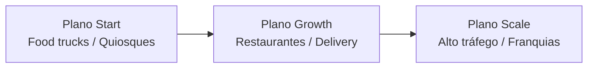
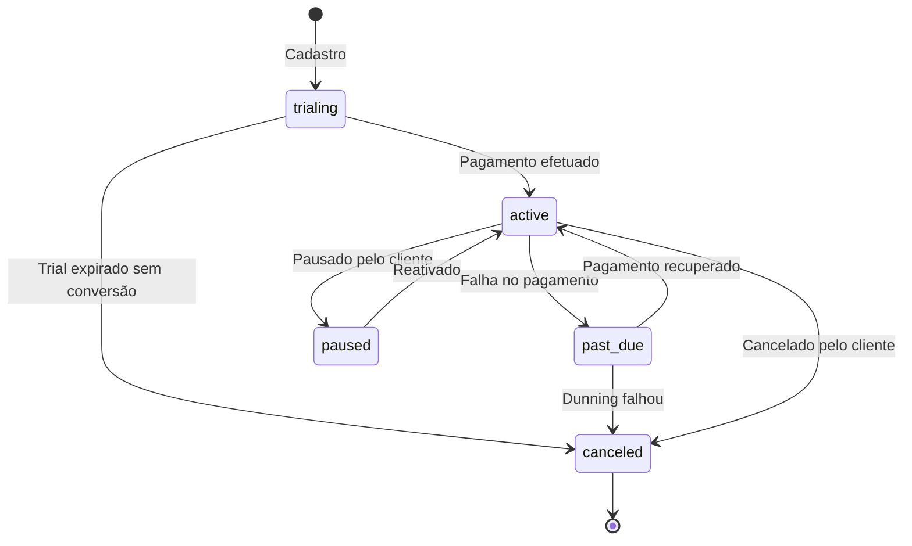

# Planos e Entitlements — Dine SaaS

> Fonte: `docs/PLANO_TATICO_90_DIAS_BRANDING_BILLING.md` + `backend/prisma/schema.prisma` | 2026-06-30

---

## Visão Geral dos Planos

A plataforma Dine oferece três planos SaaS. **Todos os planos** incluem o módulo de comandas digitais com QR Code e fechamento de pedidos na plataforma. As restrições escalam volume e complexidade operacional.



---

## Plano Start

**Foco:** Pequenas operações e digitalização essencial.

**Público-alvo:** Food trucks, quiosques, pequenos bares.

| Recurso | Limite |
|---------|--------|
| Produtos no cardápio | ~100 produtos |
| Usuários de painel | 1 (apenas gestor/dono) |
| Mesas simultâneas | até 15 |
| Pedidos online com pagamento integrado | Sim |
| Relatórios | Essenciais (vendas do dia) |
| Suporte | E-mail / Ticket (SLA 24-48h) |
| KDS (Kitchen Display) | Não |
| Multi-lojas | Não |
| Whitelabel | Não |
| CRM avançado | Não |
| Automações de marketing | Não |

---

## Plano Growth (Principal)

**Foco:** Restaurantes que precisam alavancar delivery e rotacionar o salão.

**Público-alvo:** Restaurantes de médio porte, operações com delivery ativo.

| Recurso | Limite |
|---------|--------|
| Produtos no cardápio | Ilimitado |
| Comandas e mesas ativas | Ilimitado |
| Usuários de painel | Até 5 (Gestão, Caixa, Garçom) |
| Pedidos online com pagamento integrado | Sim |
| Roteamento para impressoras | Básico |
| Relatórios | Avançados (Curva ABC, rentabilidade mensal) |
| Suporte | Prioritário via WhatsApp (horário comercial) |
| KDS (Kitchen Display) | Não |
| Multi-lojas | Não |
| Whitelabel | Não |
| CRM | Sim |
| Automações de marketing | Sim |

---

## Plano Scale

**Foco:** Alto tráfego, franquias e operações complexas.

**Público-alvo:** Redes de restaurantes, operações com múltiplos salões.

| Recurso | Limite |
|---------|--------|
| Produtos no cardápio | Ilimitado |
| Usuários e permissões | Ilimitado |
| Pedidos online com pagamento integrado | Sim |
| KDS Nativo | Sim (Kitchen Display System) |
| Hub Multi-Lojas | Sim (painel de matriz) |
| Whitelabel / Domínio próprio | Sim (`pedidos.marca.com.br`) |
| Relatórios | Completos |
| Suporte | VIP, plantão comercial, Customer Success dedicado |
| CRM | Sim |
| Automações de marketing | Sim |

---

## Comparativo Rápido

| Feature | Start | Growth | Scale |
|---------|-------|--------|-------|
| Comanda digital QR Code | Sim | Sim | Sim |
| Delivery | Sim | Sim | Sim |
| Pagamento integrado | Sim | Sim | Sim |
| Relatórios avançados | Não | Sim | Sim |
| Usuários múltiplos | 1 | 5 | Ilimitado |
| KDS nativo | Não | Não | Sim |
| Multi-lojas | Não | Não | Sim |
| Whitelabel | Não | Não | Sim |

---

## Trial

- **Duração:** 15 dias (campo `trialEndsAt` em `Assinatura`)
- **Status inicial:** `trialing`
- **Sem cartão obrigatório** no início (Product-Led Growth)
- **Alerta progressivo** nos últimos dias do trial no dashboard
- **Conversão:** paywall ao fim do trial com captura de método de pagamento

---

## Estados da Assinatura



| Status | Descrição | Acesso à Plataforma |
|--------|-----------|---------------------|
| `trialing` | Período de trial ativo | Completo |
| `active` | Assinatura ativa e paga | Completo |
| `past_due` | Pagamento em atraso | Degradado (bloqueio gradual) |
| `canceled` | Cancelado | Bloqueado |
| `incomplete` | Checkout incompleto | Bloqueado |
| `incomplete_expired` | Checkout expirado | Bloqueado |
| `unpaid` | Não pago | Bloqueado |
| `paused` | Pausado | Bloqueado |

---

## Implementação Técnica

O campo `Plano.features` é um JSON com as capacidades habilitadas:
```json
{
  "maxProdutos": 100,
  "maxUsuarios": 1,
  "maxMesas": 15,
  "kds": false,
  "multiLojas": false,
  "whitelabel": false,
  "relatoriosAvancados": false,
  "automacoes": false,
  "crm": false
}
```

A verificação de entitlements deve ocorrer no backend antes de operações que ultrapassam limites.

---

## Integrações de Cobrança

- **Stripe:** Cobrança recorrente via `Assinatura.stripeSubscriptionId`
- **Webhooks Stripe:** `POST /api/assinaturas/webhook/stripe` atualiza status da assinatura
- **Portal do gestor:** Seção "Plano e Faturamento" no painel admin
