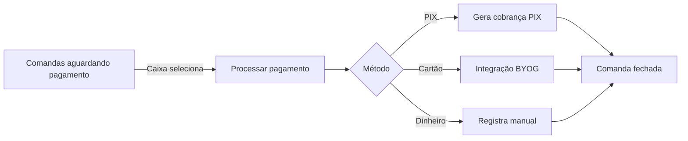

# Módulo: Caixa

> 2026-06-30

---

## Objetivo

Centralizar o processamento de pagamentos finais, fechamento de comandas e geração de relatórios de vendas.

---

## Rotas

| Método | Rota | Auth | Descrição |
|--------|------|------|-----------|
| GET | /api/caixa/comandas | admin | Comandas aguardando pagamento |
| POST | /api/caixa/comandas/:id/pagar | admin | Processar pagamento final |
| POST | /api/caixa/comandas/:id/fechar | admin | Fechar comanda |
| GET | /api/caixa/relatorio | admin | Relatório de vendas (filtros: dataInicio, dataFim) |

---

## Tela do Frontend

| Rota | Descrição |
|------|-----------|
| /caixa | Painel com comandas em status `aguardando_pagamento` |

---

## Fluxo

---

## Relatório de Vendas

Parâmetros de filtro:
- `dataInicio` — data/hora de início
- `dataFim` — data/hora de fim

Retorna: total de vendas, número de comandas, ticket médio (conforme implementação do controller).
