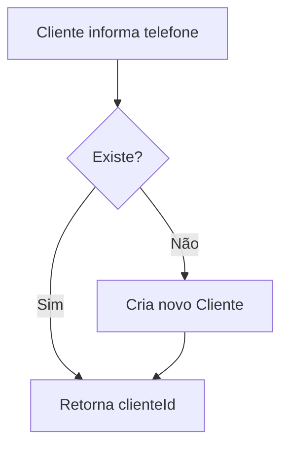

# Módulo: Cliente

> 2026-06-30

---

## Objetivo

Gerenciar clientes do delivery, seus endereços e o fluxo de identificação/login para pedidos online.

---

## Identificação

Clientes são identificados por **telefone** dentro de cada estabelecimento. O mesmo número de telefone pode existir em múltiplos estabelecimentos.

---

## Rotas

| Método | Rota | Auth | Descrição |
|--------|------|------|-----------|
| POST | /api/cliente/delivery/registrar | Não | Identificar ou criar cliente por telefone |
| POST | /api/cliente/delivery/login | Não | Login com telefone |
| GET | /api/cliente/delivery/:id | Não | Buscar dados do cliente |
| GET | /api/cliente/delivery/:clienteId/enderecos | Não | Listar endereços |
| POST | /api/cliente/delivery/enderecos | Não | Adicionar endereço |

---

## Fluxo de Registro

---

## Endereços

O cliente pode salvar múltiplos endereços. Um endereço pode ser marcado como `padrao = true`.

Campos do endereço:
- `cep`, `logradouro`, `numero`, `complemento`, `bairro`, `cidade`, `estado`
- `referencia` — ponto de referência
- `padrao` — endereço padrão

---

## Tela do Frontend (CRM)

| Rota | Papel | Descrição |
|------|-------|-----------|
| /admin/clientes | admin | Gestão de clientes |
