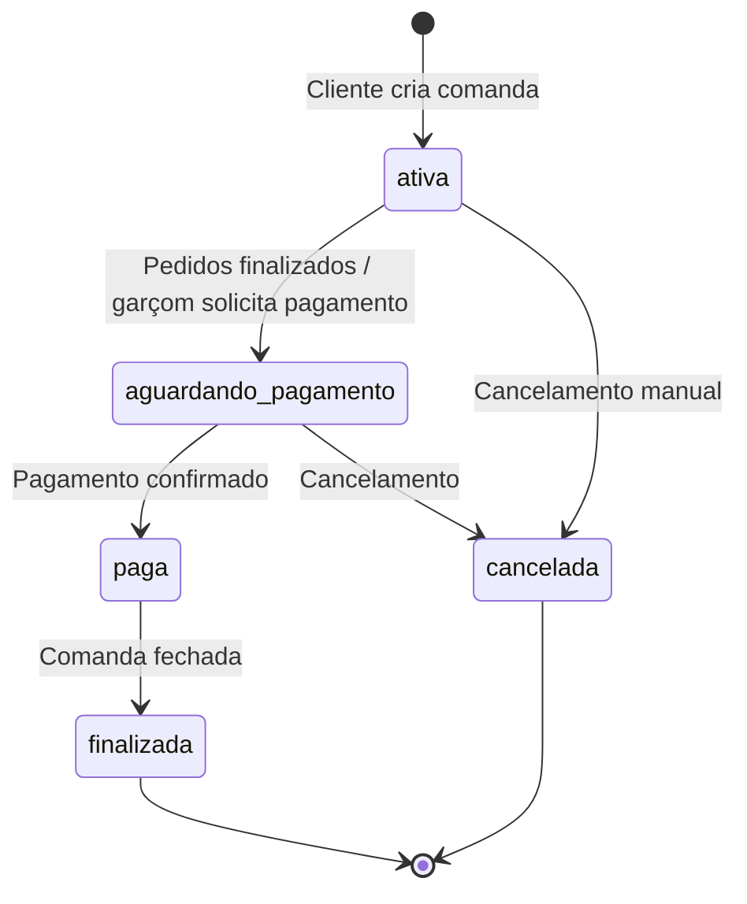
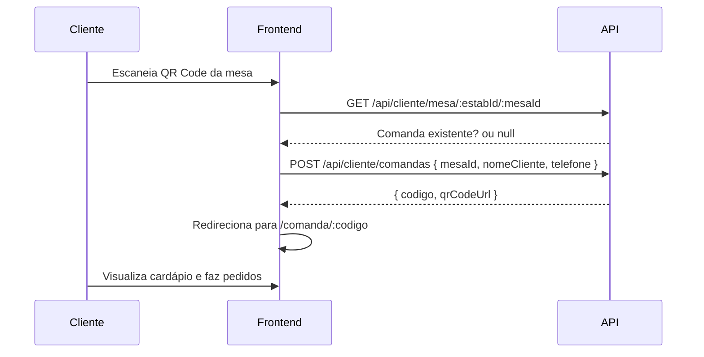
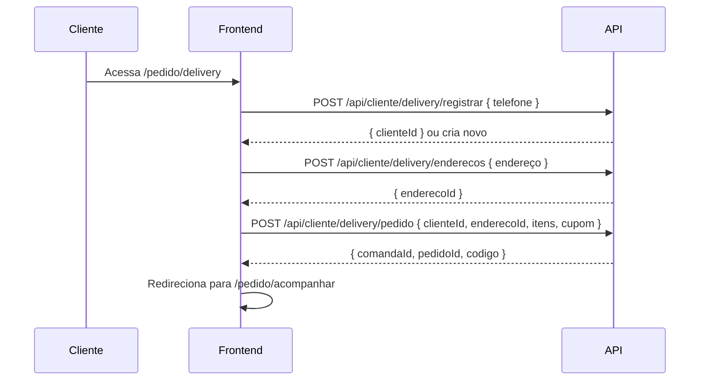

# Módulo: Comanda

> Coração do sistema Dine | 2026-06-30

---

## Objetivo

A comanda é a entidade central que representa uma sessão de consumo de um cliente. Todo pedido pertence a uma comanda. O cliente acessa o sistema via QR Code ou link e cria sua comanda.

---

## Tipos de Comanda

| Tipo | Descrição | Criado por |
|------|-----------|-----------|
| `mesa` | Vinculada a uma mesa física com QR Code | Cliente via QR Code |
| `individual` | Sem mesa, identificada por código único | Cliente via link |
| `delivery` | Com endereço de entrega, para delivery | Cliente via app/site |

---

## Ciclo de Vida

---

## Fluxo do Cliente (Mesa)

---

## Fluxo do Cliente (Delivery)

---

## Rotas Relevantes

| Método | Rota | Auth | Descrição |
|--------|------|------|-----------|
| POST | /api/comandas | Não | Criar comanda |
| GET | /api/comandas/codigo/:codigo | Não | Buscar por código |
| GET | /api/comandas/:id | Não | Buscar por ID |
| GET | /api/comandas/:id/pedidos | Não | Listar pedidos da comanda |
| PATCH | /api/comandas/:id/status | Não | Atualizar status |
| POST | /api/cliente/comandas | Não | Criar comanda (fluxo cliente) |
| GET | /api/cliente/comandas/:codigo | Não | Ver status |

---

## Campos Importantes

| Campo | Tipo | Descrição |
|-------|------|-----------|
| `codigo` | String (unique) | Código público da comanda (ex: A001) |
| `tipoComanda` | Enum | mesa / individual / delivery |
| `status` | Enum | ativa / aguardando_pagamento / paga / finalizada / cancelada |
| `totalEstimado` | Decimal | Soma dos pedidos |
| `taxaEntrega` | Decimal | Taxa de entrega (delivery) |
| `desconto` | Decimal | Valor do cupom aplicado |
| `qrCodeUrl` | String | QR Code da comanda (LongText) |
| `cupomId` | FK | Cupom de desconto aplicado |
| `clienteId` | FK | Cliente delivery (opcional) |
| `enderecoEntregaId` | FK | Endereço delivery (opcional) |

---

## Relacionamentos

- Uma comanda tem **N pedidos**
- Uma comanda pode ter **1 avaliação**
- Uma comanda pode ter **N pagamentos parciais**
- Uma comanda pode ter **N transações**
- Uma comanda delivery tem **1 corrida**
- Uma comanda pode ter **N pedidos externos** (omnichannel)

---

## Limitações Conhecidas

1. O campo `comanda.mesa` (String) está deprecated — usar `mesaId` (FK para Mesa)
2. Uma comanda não pode ser transferida entre estabelecimentos
3. Não há histórico de alterações da comanda (apenas dos pedidos)
