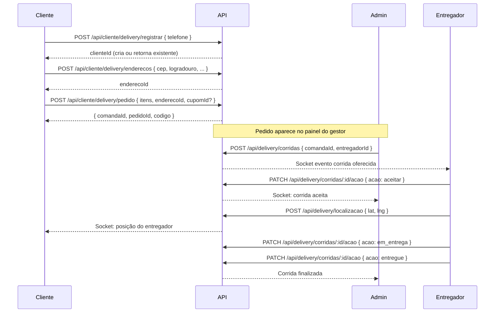

# Módulo: Delivery

> 2026-06-30

---

## Objetivo

Gerenciar pedidos de delivery do cliente final até a entrega, incluindo cadastro de clientes, endereços, corridas de entregadores e rastreamento GPS.

---

## Fluxo Completo de Delivery



---

## Entidades

### Cliente
- Identificado por telefone + estabelecimentoId
- Pode ter múltiplos endereços
- Pode ter senha para login subsequente

### Corrida
Representa a entrega física:

| Status | Descrição |
|--------|-----------|
| `oferecida` | Admin criou, aguarda aceitação |
| `aceita` | Entregador aceitou |
| `recusada` | Entregador recusou |
| `em_coleta` | Entregador a caminho do estabelecimento |
| `coletada` | Entregador coletou o pedido |
| `em_entrega` | Entregador a caminho do cliente |
| `entregue` | Entrega confirmada |
| `cancelada` | Corrida cancelada |

---

## Status do Entregador

```
offline → online → em_corrida
                 → pausado
```

---

## Rotas

### Admin
| Método | Rota | Descrição |
|--------|------|-----------|
| GET | /api/delivery/entregadores | Listar entregadores |
| GET | /api/delivery/entregadores/:id/localizacao | Última localização |
| POST | /api/delivery/corridas | Criar corrida |
| GET | /api/delivery/corridas | Listar corridas |
| PATCH | /api/delivery/corridas/:id/status | Atualizar status (admin) |

### Entregador
| Método | Rota | Descrição |
|--------|------|-----------|
| PATCH | /api/delivery/meu-status | Atualizar status próprio |
| GET | /api/delivery/minhas-corridas | Ver corridas próprias |
| PATCH | /api/delivery/corridas/:id/acao | Avançar estado da corrida |
| POST | /api/delivery/localizacao | Enviar GPS |

---

## Telas do Frontend

| Rota | Papel | Descrição |
|------|-------|-----------|
| /pedido/delivery | Cliente | Checkout delivery |
| /pedido/confirmar | Cliente | Confirmação do pedido |
| /pedido/pagamento | Cliente | Pagamento |
| /pedido/acompanhar | Cliente | Rastreamento |
| /entregador | Entregador | App do entregador |
| /admin/entregadores | Admin | Gestão de entregadores |
| /admin/pedidos | Admin | Kanban incluindo delivery |
