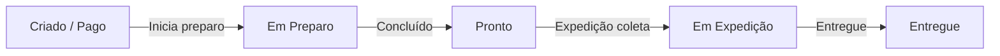

# Módulo: KDS — Kitchen Display System

> Cozinha + Bar | 2026-06-30

---

## Objetivo

Exibir pedidos em tempo real para a equipe de preparo (cozinha e bar), permitindo atualização de status diretamente na tela sem papel.

---

## Telas

| Rota Frontend | Papel | Destino dos Pedidos |
|--------------|-------|---------------------|
| /cozinha | cozinha / admin | COZINHA |
| /bar | bar / admin | BAR |

---

## Rotas da API

| Método | Rota | Auth | Descrição |
|--------|------|------|-----------|
| GET | /api/cozinha/pedidos | cozinha/bar/admin | Listar pedidos (filtro: destino, status) |
| PUT | /api/cozinha/pedidos/:id/status | cozinha/bar/admin | Atualizar status |
| GET | /api/cozinha/estatisticas | cozinha/bar/admin | Estatísticas do período |

---

## Kanban de Status

```
Fila (criado/pago) → Em Preparo → Pronto → [Expedição]
```

Os pedidos aparecem em colunas Kanban ordenados por hora de criação. O mais antigo aparece primeiro.

---

## Filtro por Destino

O parâmetro `?destino=BAR` ou `?destino=COZINHA` filtra pedidos pelo destino da categoria dos produtos.

- **Tela `/cozinha`** → filtra destino=COZINHA
- **Tela `/bar`** → filtra destino=BAR

---

## Realtime (Socket.io)

Quando um pedido é criado, o servidor emite evento na sala do estabelecimento:
```
socket.emit('pedido:novo', { pedidoId, destino, ... })
```

O KDS escuta esse evento e adiciona o pedido ao Kanban automaticamente sem necessidade de reload.

---

## Fluxo de Status no KDS



Cada transição registra timestamp e cria `HistoricoStatusPedido`.

---

## Integração com Expedição

Após um pedido atingir status `pronto`, ele aparece no painel de expedição (`/expedicao`) para ser separado e enviado ao cliente.
