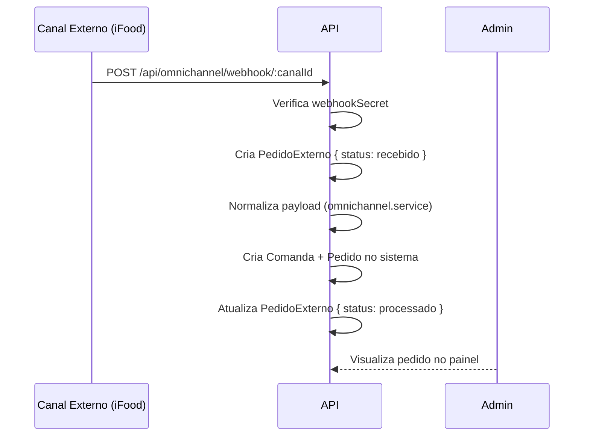

# Módulo: Omnichannel

> 2026-06-30

---

## Objetivo

Integrar pedidos recebidos de canais externos (iFood, WhatsApp, Rappi, etc.) com o fluxo interno de pedidos do Dine via webhooks.

---

## Canais Suportados

| Canal | TipoCanal |
|-------|-----------|
| WhatsApp | whatsapp |
| iFood | ifood |
| Rappi | rappi |
| Instagram | instagram |
| Site próprio | site_proprio |
| Telefone | telefone |
| Genérico | generico |

---

## Fluxo de Integração



---

## Rotas Admin

| Método | Rota | Auth | Descrição |
|--------|------|------|-----------|
| GET | /api/omnichannel/canais | admin | Listar canais |
| POST | /api/omnichannel/canais | admin | Configurar canal |
| PUT | /api/omnichannel/canais/:id | admin | Atualizar canal |
| DELETE | /api/omnichannel/canais/:id | admin | Remover canal |
| GET | /api/omnichannel/canais/:id/pedidos | admin | Pedidos do canal |

---

## Webhook Público

```
POST /api/omnichannel/webhook/:canalId
```

- Não requer autenticação JWT
- Verificação via `CanalExterno.webhookSecret`
- Idempotência via `PedidoExterno.externalId`

---

## Tela do Frontend

| Rota | Descrição |
|------|-----------|
| /admin/canais | Configuração de canais omnichannel |
