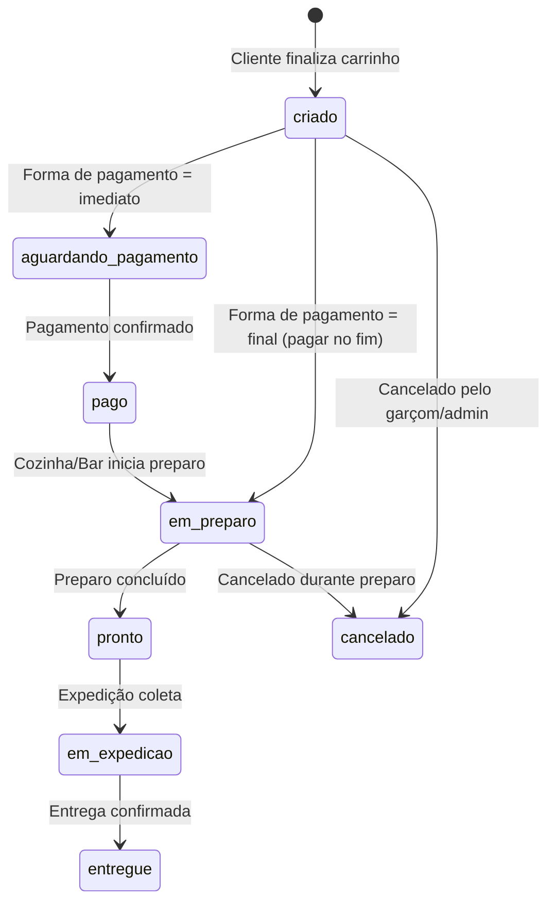

# Módulo: Pedido

> 2026-06-30

---

## Objetivo

O pedido é um agrupamento de itens (`PedidoItem`) dentro de uma comanda. Um cliente pode fazer múltiplos pedidos na mesma comanda. O pedido é roteado automaticamente para bar ou cozinha com base no `destino` dos produtos.

---

## Ciclo de Vida



---

## Destino do Pedido

O `destino` é herdado da `Categoria` dos produtos:

```
Produto → Categoria → destino (BAR | COZINHA)
```

- Pedidos com produtos de categorias `BAR` → aparecem no KDS do bar
- Pedidos com produtos de categorias `COZINHA` → aparecem no KDS da cozinha
- Um pedido pode ter `destino = null` se contiver mix de destinos

---

## Rotas Relevantes

| Módulo | Ação |
|--------|------|
| /api/cliente/pedidos | Cliente cria pedido |
| /api/cozinha/pedidos | KDS lista e atualiza status |
| /api/garcom/pedidos/:id/aprovar | Garçom aprova |
| /api/garcom/pedidos/:id/rejeitar | Garçom rejeita |
| /api/expedicao/pedidos | Expedição lista e avança status |
| /api/caixa/comandas/:id/pagar | Caixa fecha e paga |

---

## Campos Importantes

| Campo | Descrição |
|-------|-----------|
| `numeroPedido` | Número sequencial dentro da comanda |
| `status` | Status atual do pedido |
| `destino` | BAR ou COZINHA (roteamento automático) |
| `total` | Soma dos itens + adicionais |
| `aprovadoPor` | ID do usuário que aprovou (garçom) |
| Timestamps | aprovadoAt, emPreparoAt, prontoAt, emExpedicaoAt, entregueAt, canceladoAt |

---

## Histórico de Status

Todo status change gera um registro em `HistoricoStatusPedido`:
- `statusAnterior` — estado antes da mudança
- `statusNovo` — novo estado
- `usuarioId` — quem fez a mudança (nullable para ações do cliente)
- `observacao` — motivo (ex: "Cancelado: falta de ingrediente")

---

## Adicionais

```
PedidoItem → PedidoItemAdicional → Adicional
```

Cada item do pedido pode ter adicionais selecionados. O preço do adicional é "congelado" no momento do pedido (`PedidoItemAdicional.preco`), garantindo histórico correto mesmo se o preço mudar depois.
